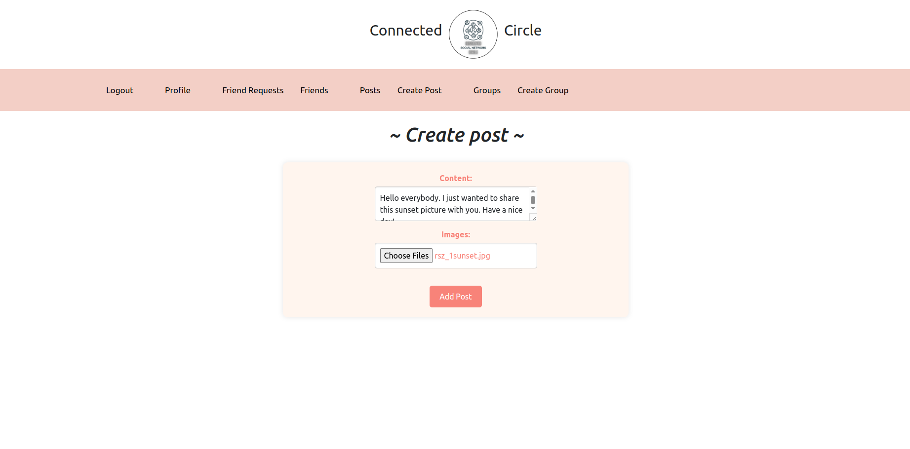
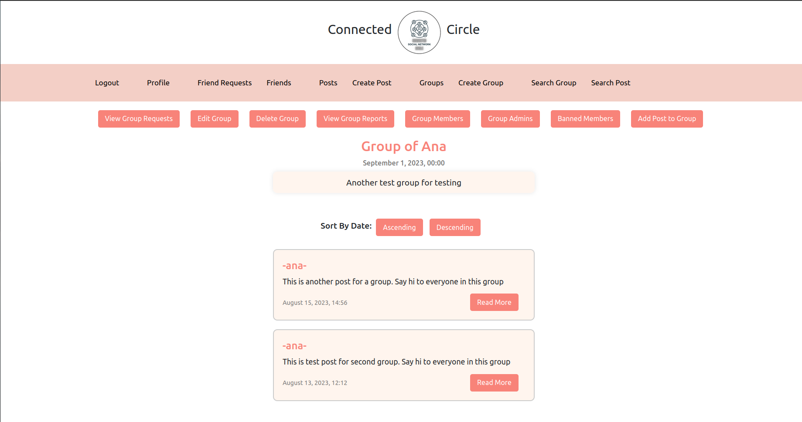

# Connected-Circle 

## Project Overview

This repository contains the implementation for a social network application, inspired by popular platforms like Facebook, Instagram, and Twitter. The application provides various functionalities for users, including registration, posting, commenting, group creation, and more.

### Applications
- **Server**: Java Spring Boot backend. [Server Repository](https://github.com/flower0408/Connected-Circle)
- **Web Client**: Angular frontend.
  
## Launch Guide

Below are the steps to get the project up and running on your local environment.

### Prerequisites:
1. Java 11 or higher
2. Maven
3. MySQL
4. Elasticsearch
5. MinIO
6. Node.js
7. Docker
8. IntelliJ IDEA
9. Visual Studio Code

### Step 1: Clone the Repository
Clone the repository to your local machine:
```bash
git clone https://github.com/flower0408/Connected-Circle
```

### Step 2: Import the Project in IntelliJ IDEA
Open IntelliJ IDEA and import the cloned repository.

### Step 3: Load Maven Dependencies
Ensure all necessary Maven dependencies are downloaded.

### Step 4: Set Up the Database
- Ensure MySQL is installed and running.
- Create a database named `svt_kvt_project`.
- Update the `application.properties` file with your MySQL credentials.

### Step 5: Run the Application

### Step 6: Start Angular Frontend
1. Open Visual Studio Code.
2. Navigate to the frontend directory in the cloned repository.
3. Start the Angular app with npm:
```bash
npm install
ng serve --proxy-config proxy.conf.json

```

### Step 7: Access the Platform
Once the services are up and running, you can access the platform via the provided endpoints:
- **Frontend:** Open a web browser and go to [http://localhost:4200/](http://localhost:4200/)

### Option 2: Additional Steps for Elastic Search Branch

#### Step 1: Switch to Elastic Search Branch
```bash
git checkout elastic-search
```

#### Step 2: Set Up Elasticsearch and MinIO
- Ensure Elasticsearch is installed and running.
- Ensure MinIO is installed and running.
- Update the `application.properties` file with your Elasticsearch and MinIO configurations.

#### Step 3: Install ICU Tokenizer
```bash
sudo docker exec -it ddmdemo-elasticsearch /bin/bash
elasticsearch-plugin install analysis-icu
# Restart Elasticsearch
```

#### Step 4: Build Docker Images and Start Docker Compose
```bash
docker compose build
docker compose up
```


## Functionalities

- **User Registration:** Users can register, with a system administrator already predefined in the system.
- **Login and Logout:** Users can log in and out of the system. Access to other functionalities requires logging in.
- **Handling Posts:** Users can create posts with or without images.
- **Comment Update:** Users can reply to comments, and multiple replies are possible.
- **User Reactions:** Users can respond to posts and comments with likes, dislikes, and hearts.
- **Sorting Comments:** Comments can be sorted based on likes, dislikes, hearts, and publication date.
- **Sorting Posts:** Posts can be sorted by publication date in ascending or descending order.
- **Handling Groups:** Users can create and administer groups. Group administrators can suspend groups.
- **Reporting:** Users can report inappropriate content or users. Administrators can review and take actions.
- **Overview of Home Page:** Registered users see random public posts and posts from their friends or random groups.
- **Change Password:** Users can change their password by entering the current password twice and providing a new one.
- **Change Profile Data:** Users can set their display name, profile description, and profile picture. The user's group memberships are also displayed.
- **User Search:** Users can search for new friends based on first and last names. Friend requests can be sent and approved or rejected.
- **Blocking and Unblocking Users:** Group administrators can block and unblock users within their group.
- **Group Join Requests:** Group administrators can approve or reject incoming requests to join the group.
- **Removing Group Administrators:** System administrators can remove group administrators, reverting them to regular users.
- **Group Suspension:** System administrators can suspend groups, providing a reason for suspension. The app automatically removes group administrators from suspended groups.

## Non-functional Requirements

- User authentication using username and password.
- Authorization using the token mechanism.
- Log messages about important events during application execution.

## Elastic Search Branch Functionalities
This section describes the additional functionalities implemented in the Elastic search branch. The Elastic search branch can be found [here](https://github.com/flower0408/Connected-Circle/tree/elastic-search).

- Indexing of groups and posts in Elasticsearch, and saving documents in the MinIO database.

### Group Search:
- Search groups by name
- Search groups by description
- Search groups by description from the attached PDF file
- Search groups by the range of the number of posts (from - to), where the lower and/or upper limit of the range can be set
- Search groups by the average number of likes of posts in the group in the range (from - to), where the lower and/or upper limit of the range can be set
- Combine previous search parameters (BooleanQuery, enable AND and OR operator between fields)
- Preprocess the query to be case-insensitive, supporting both Cyrillic and Latin alphabets
- Provide support in form fields for PhraseQuery and FuzzyQuery input
- Display results showing the name of the group, the number of posts and the average number of likes

### Post Search:
- Search posts by title
- Search posts by text
- Search posts by text from the attached PDF file
- Search posts by text in comments
- Search posts by the number of likes (from - to, including likes on the post itself and in comments), where the lower and/or upper range limit can be set
- Combine previous search parameters (BooleanQuery, enable AND and OR operator between fields)
- Preprocess the query to be case-insensitive, supporting both Cyrillic and Latin alphabets
- Provide support in form fields for PhraseQuery and FuzzyQuery input
- Search posts that have a number of comments in the range (from-to), with a lower and/or upper range limit
- Display results showing the title of the post and the text of the post
- 
## Technologies Used
- Spring framework
- Spring Boot
- MySQL
- Angular framework
- Elasticsearch
- MinIO


## Application Architecture

The application consists of a web browser, a Spring container (Spring Boot), and a relational database (SUBP), also Elasticsearch and MinIO. The backend communicates with the frontend via a RESTful service.


## Data Model
The data model includes entities:
- The User entity represents registered user of the application and is intended to store data used for authentication and authorization. 
- An unregistered user can only register to the application. 
- A user can also be a system administrator or a group administrator.
- A group administrator maintains a specific group, while a system administrator manages it application and has the ability to remove groups. 
- Posts are described by the Post entity and they are text, but can also contain images. 
- The Comment entity represents a comment in a given application. 
- The Reaction entity represents a reaction to certain posts or comments.
- If the content violates community or application rules, a related Report entity is created to a post, comment or user. 
- The Group entity represents a group that contains posts and comments are owned by users and maintained by the group administrator.
  
  
## Images of project

### Login and Register


### Main page, Posts, Groups


### Create and Edit Post



### Create Group


### Group of User


### Group of Admin


### Group Requests, Group Members


### Profile


### Search For Friends


### Friend Requests


### Report


### Search Group


### Search Post


### Create Post, Create Group Elastic Search Branch


